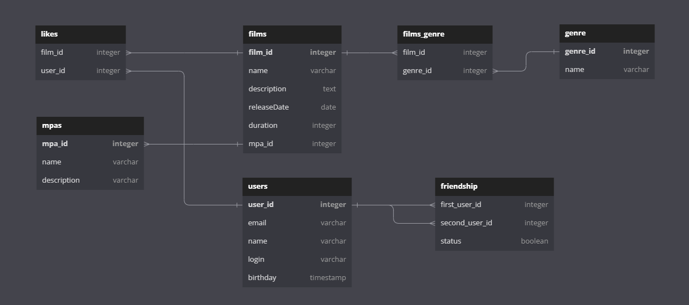

# java-filmorate
Template repository for Filmorate project.

# ЕR диаграмма filmorate



[Ссылка на диаграмму](src/main/resources/ER-filmorate.png)

[Ссылка на диаграмму в редакторе диаграмм](https://dbdiagram.io/d/6436b0d58615191cfa8d5bbd)
## Описание ER диаграммы filmorate:

Таблица film с внешним ключом film_id, по которому она связана с таблицей films_genre, так же содержащей поле genre_id.
Имена жанров располагаются в таблице genre, genre_id является внешним ключом. И так же связана с таблицей rating, в
которой есть две колонки: rating_id (внешний ключ) и name.

Таблица users с внешним ключом user_id. В Таблице likes имеются поля film_id и user_id, по которой мы можем определить
какие пользователи какому фильму ставили лайки. Чтобы определить, какой из пользователей какому является другом, есть
таблица friendship, которая содержит три поля: first_user_id (user отправляющий запрос на добавление в друзья), second_user_id
и состояние запроса принято/не принято.

## Примеры запросов

### Film

#### Получение всех фильмов

```
SELECT * FROM film;
```

#### Выдать фильм по id

```
SELECT name FROM films
WHERE film_id = 'somenumber'
```

#### Добавить фильм

```
INSERT INTO film (name, description, releaseDate, duration, rating_id)
VALUES ('aaa', 'bbb', 'yyyy.mm.dd', 'ccc', x); 
```

#### Обновить фильм

```
INSERT INTO film (name, description, releaseDate, duration, rating_id)
VALUES (q, 'aaa', 'bbb', 'yyyy.mm.dd', 'ccc', x) WHERE film_id = q 
ON CONFLICT (q) DO UPDATE SET name = EXCLUDED.name, 
                              description = EXCLUDED.description, 
                              releaseDate = EXCLUDED.releaseDate, 
                              duration = EXCLUDED.duration, 
                              rating_id = EXCLUDED.rating_id; 
```

#### Пользователь ставит лайк

```
INSERT INTO likes (film_id, user_id)
VALUES ('somefilm_id', 'someuser_id');
```

#### Пользователь удаляет лайк

```
DELETE FROM likes WHERE film_id = somefilm_id AND user_id=someuser_id;
```

#### Удалить фильм

```
DELETE FROM film WHERE id = q; 
```

#### Выдать top count фильмов

```
SELECT f.title, count(*) AS count
FROM film AS f
LEFT JOIN likes AS k ON f.film_ id = k.film_id
GROUP BY f.title
ORDER BY count DESС
LIMIT(top_film);
```
### User

#### Получение списка всех пользователей

```
SELECT * FROM users;
```

#### Добавление пользователя

```
INSERT INTO user (email, name, login, birthday)
VALUES ('aaa', 'bbb', 'ccc', 'yyyy.mm.dd'); 
```

#### Обновление пользователя

```
INSERT INTO user (email, name, login, birthday)
VALUES ('aaa', 'bbb', 'ccc', 'yyyy.mm.dd') WHERE user_id = q ; 
ON CONFLICT (q) DO UPDATE SET email = EXCLUDED.email, 
                              name = EXCLUDED.name, 
                              login = EXCLUDED.login, 
                              birthday = EXCLUDED.birthday; 

```

#### Удаление пользователя

```
DELETE FROM users WHERE id = q; 
```

#### Найти пользователя по id

```
SELECT name FROM users
WHERE user id = 'somenumber';
```

#### Список друзей пользователя

```
SELECT name 
FROM users 
WHERE users_id =  (SELECT id 
		  FROM (
			SELECT second_user_id
		  	FROM fiendship
		  	WHERE first_user_id ='somenumber" AND status = 'confirm'
		  UNION 
			SELECT first_user_id
		  	FROM fiendship
		  	WHERE second_user_id ='somenumber' AND status = 'confirm);
```

#### Общий список друзей пользователя

```
SELECT name 
FROM users 

WHERE users_id = (SELECT id 
		  FROM (
			SELECT second_user_id
		  	FROM fiendship
		  	WHERE first_user_id ='somenumber" AND status = 'confirm'
		  UNION 
			SELECT first_user_id
		  	FROM fiendship
		  	WHERE second_user_id ='somenumber' AND status = 'confirm) AS t1
		  INNER JOIN (
			SELECT second_user_id
			FROM fiendship
		  	WHERE first_user_id ='somenumber_2" AND status = 'confirm'
		  UNION 
			SELECT first_user_id
		  	FROM fiendship
		  	WHERE second_user_id ='somenumber_2' AND status = 'confirm) AS t2
		  ON t1.second_user_id = t2.second_user_id); 
```